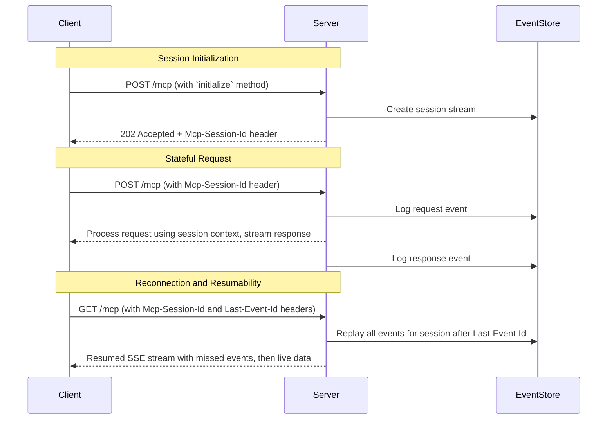

# Calculator Learning Demo - Streamable HTTP (Stateful) Transport

<div align="center">

[](https://modelcontextprotocol.io)
[](https://www.typescriptlang.org/)
[](https://spec.modelcontextprotocol.io/specification/basic/transports/#streamable-http)
[](https://smithery.ai/server/@yigitkonur/example-mcp-server-streamable-http)
[](LICENSE)

</div>

## 🎯 Overview

This repository provides a reference implementation of a **stateful MCP calculator server using the Streamable HTTP transport**. This server is engineered to demonstrate an enterprise-grade, session-based architecture with persistent state, event replay for full stream resumability, and support for complex, multi-step workflows. It is the recommended transport for robust client-server applications.

### Key Characteristics

*   **Single Endpoint**: Utilizes a single, consistent `/mcp` endpoint for all client-server communication, simplifying routing and firewall configuration.
*   **Persistent Sessions**: Maintains server-side state for each client session, identified by a unique `Mcp-Session-Id` header. State persists for 30 minutes of inactivity.
*   **Full Resumability**: Lost connections can be seamlessly resumed using the `Last-Event-Id` header. The server's event store replays all missed messages, ensuring zero data loss.
*   **Event Sourcing**: Implements an in-memory event store that logs all requests and responses, enabling a complete audit trail and the resumability feature.
*   **Ideal Use Case**: Enterprise APIs, complex interactive workflows, financial applications, and any system requiring robust state management and guaranteed message delivery.

## 📊 Transport Comparison

This table compares the four primary MCP transport mechanisms demonstrated in the learning series. The implementation in **this repository is highlighted**.

| Dimension | STDIO | SSE (Legacy) | **Streamable HTTP (Stateful)** | Streamable HTTP (Stateless) |
|:-----------|:-----------|:---------|:---------------------|:-------------------------------|
| **Transport Layer** | Local Pipes (`stdin`/`stdout`) | 2 × HTTP endpoints (`GET`+`POST`) | ✅ **Single HTTP endpoint `/mcp`** | Single HTTP endpoint `/mcp` |
| **Bidirectional Stream** | ✅ Yes (full duplex) | ⚠️ Server→Client only | ✅ **Yes (server push + client stream)** | ✅ Yes (within each request) |
| **State Management** | Ephemeral (Process Memory) | Ephemeral (Session Memory) | ✅ **Persistent (Session State)** | ❌ None (Stateless) |
| **Resumability** | ❌ None | ❌ None | ✅ **Yes (`Last-Event-Id`)** | ❌ None (by design) |
| **Scalability** | ⚠️ Single Process | ✅ Multi-Client | ✅ **Horizontal (Sticky Sessions)** | ♾️ Infinite (Serverless) |
| **Security** | 🔒 Process Isolation | 🌐 Network Exposed | 🌐 **Network Exposed** | 🌐 Network Exposed |
| **Ideal Use Case** | CLI Tools, IDE Plugins | Legacy Web Apps | ✅ **Enterprise APIs, Workflows** | Serverless, Edge Functions |

## 📐 Architecture and Flow

The stateful Streamable HTTP transport manages the entire client lifecycle through a single endpoint. It creates a dedicated server instance and state object for each session, which is persisted in memory. An integrated event store tracks every message, allowing clients to reconnect and resume their session exactly where they left off, making the system resilient to network interruptions.



## ✨ Feature Compliance

This server implements the complete MCP Golden Standard feature set, enhanced with stateful capabilities that leverage session context.

| Name | Status | Implementation |
|:------|:--------|:----------------|
| `calculate` | **Core ✅** | Basic arithmetic with session-scoped history and resumable progress streaming. |
| `batch_calculate` | **Extended ✅** | Processes multiple calculations, storing all results in the session history. |
| `advanced_calculate` | **Extended ✅** | Factorial, power, sqrt, log, and trigonometric functions with results saved to the session. |
| `demo_progress` | **Extended ✅** | Demonstrates a fully resumable event stream with progress notifications. |
| `explain-calculation`| **Core ✅** | Returns a Markdown explanation, aware of session context. |
| `generate-problems`| **Core ✅** | Returns Markdown problems potentially based on session history. |
| `calculator-tutor` | **Core ✅** | Returns tutoring content adapted to the user's session progress. |
| `solve_math_problem` | **Extended ✅** | Interactive problem solving with session-based follow-up questions. |
| `explain_formula` | **Extended ✅** | Formula explanation with examples relevant to session calculations. |
| `calculator_assistant` | **Extended ✅** | General assistance that can leverage the entire session context. |
| `calculator://constants`| **Core ✅** | Resource for mathematical constants. |
| `calculator://history/{id}`| **Extended ✅** | Per-session calculation history (50-item ring buffer). |
| `calculator://stats` | **Extended ✅** | Resource for global server uptime and request statistics. |
| `session://info/{sessionId}`| **Extended ✅** | Resource for current session metadata and statistics. |
| `formulas://library` | **Extended ✅** | Resource for a collection of mathematical formulas. |

## 🚀 Getting Started

### Prerequisites

*   Node.js (v18.x or higher)
*   npm or yarn

### Installation

#### Installing via Smithery

To install example-mcp-server-streamable-http for Claude Desktop automatically via [Smithery](https://smithery.ai/server/@yigitkonur/example-mcp-server-streamable-http):

```bash
npx -y @smithery/cli install @yigitkonur/example-mcp-server-streamable-http --client claude
```

#### Installing Manually
```bash
# Clone the repository
git clone https://github.com/modelcontextprotocol/mcp-server-examples.git
cd mcp-server-examples/streamable-http

# Install dependencies
npm install

# Build the project
npm run build
```

### Running the Server

```bash
# Start the server on port 1453
npm start

# Or, run in development mode with auto-reload
npm run dev
```

### Testing with MCP Inspector

You can interact with the running server using the official MCP Inspector CLI.

```bash
npx @modelcontextprotocol/inspector http://localhost:1453/mcp
```

## 📋 API Usage Examples

The following `curl` examples demonstrate how to interact with the server.

### 1. Initialize a Session

A session is created with the first `initialize` request. The server returns the session ID in the `Mcp-Session-Id` header, which must be used in all subsequent requests.

```bash
# The -i flag shows response headers
curl -i -X POST http://localhost:1453/mcp \
     -H 'Content-Type: application/json' \
     -d '[{
       "jsonrpc": "2.0",
       "id": 1,
       "method": "initialize",
       "params": {}
     }]'

# Expected Response Headers:
# HTTP/1.1 202 Accepted
# Mcp-Session-Id: YOUR_UNIQUE_SESSION_ID
# ...
```

### 2. Perform a Stateful Calculation

Use the `Mcp-Session-Id` from the previous step to perform a calculation. The result is stored in the session's history.

```bash
curl -X POST http://localhost:1453/mcp \
     -H 'Content-Type: application/json' \
     -H 'Mcp-Session-Id: YOUR_UNIQUE_SESSION_ID' \
     -d '[{
       "jsonrpc": "2.0",
       "id": 2,
       "method": "tools/call",
       "params": {
         "name": "calculate",
         "arguments": { "a": 15, "b": 7, "op": "multiply" }
       }
     }]'
```

### 3. Resume an Interrupted Stream

If a streaming connection drops, the client can reconnect with the `Last-Event-Id` header to resume the stream without data loss.

```bash
# 1. Start a streaming request
curl -N -X POST http://localhost:1453/mcp \
     -H 'Content-Type: application/json' \
     -H 'Mcp-Session-Id: YOUR_UNIQUE_SESSION_ID' \
     -d '[{"jsonrpc":"2.0", "id":3, "method":"tools/call", "params":{"name":"demo_progress", "arguments":{"steps":10}}}]'

# ...assume the connection is interrupted after receiving an event with ID 'session-id_timestamp_42'...

# 2. Reconnect to resume the stream, replaying any missed events
curl -N -X GET http://localhost:1453/mcp \
     -H 'Accept: text/event-stream' \
     -H 'Mcp-Session-Id: YOUR_UNIQUE_SESSION_ID' \
     -H 'Last-Event-Id: session-id_timestamp_42'
```

### 4. Access Session-Specific Resources

Query resources that are unique to the current session, such as its history or metadata.

```bash
# Get information about the current session
curl -X POST http://localhost:1453/mcp \
     -H 'Content-Type: application/json' \
     -H 'Mcp-Session-Id: YOUR_UNIQUE_SESSION_ID' \
     -d '[{"jsonrpc":"2.0","id":4,"method":"resources/read","params":{"uri":"session://info/YOUR_UNIQUE_SESSION_ID"}}]'
```

## 🧠 State Management Model

**State is persistent and scoped to the session.** This server is designed for rich, stateful interactions and guarantees data integrity within a session's lifecycle.

*   **Session State**: Each session is managed by a dedicated `SessionData` object in memory, which holds its transport, MCP server instance, calculation history, and metadata. This provides complete isolation between clients.
*   **Session Lifetime**: Sessions are identified by a UUID and are automatically pruned by a garbage collection process after 30 minutes of inactivity (`SESSION_TIMEOUT`). Sessions can also be terminated explicitly via a `DELETE` request to `/mcp`.
*   **Calculation History**: A 50-item ring buffer stores the most recent calculations for each session, accessible via the `calculator://history/*` resource.
*   **Event Store**: The `InMemoryEventStore` logs every JSON-RPC message with a unique, sequential ID. This enables full stream resumability. The store prunes events older than 24 hours or when the total event count per session exceeds 10,000 to manage memory.

## 🛡️ Security Model

This transport operates over the network and implements several layers of security.

*   **Session Authentication**: The `Mcp-Session-Id` acts as an ephemeral bearer token. It is required for all requests after initialization and authenticates the client to a specific, isolated session state.
*   **Session Isolation**: The server's use of a `Map` to store session data ensures that one client cannot access or interfere with another's state.
*   **Automatic Timeouts**: The 30-minute inactivity timeout automatically cleans up abandoned sessions, minimizing the risk of resource leaks and session hijacking.
*   **Input Validation**: All incoming parameters are rigorously validated on every request using Zod schemas to prevent malformed data and injection attacks.
*   **Rate Limiting**: The `/mcp` endpoint is protected by a rate limiter (`express-rate-limit`) to prevent denial-of-service attacks, configured by default to 1000 requests per 15 minutes.

## 🧪 Testing

This project includes a comprehensive suite of tests to validate its stateful and resumable behavior.

```bash
# Run all tests (unit, integration, e2e)
npm test

# Run only unit tests
npm run test:unit

# Run only integration tests
npm run test:integration

# Run only end-to-end tests
npm run test:e2e

# Run tests in watch mode for active development
npm run test:watch
```

## 📚 Project Resources

*   [MCP Specification](https://spec.modelcontextprotocol.io)
*   [Model Context Protocol Documentation](https://modelcontextprotocol.io)
*   [Streamable HTTP Transport Documentation](https://spec.modelcontextprotocol.io/specification/basic/transports/#streamable-http)

## 📝 License

This project is licensed under the MIT License.

---

<p align="center">
  ✅ <strong>Stateful Reference Implementation - MCP Learning Edition</strong>
</p>
