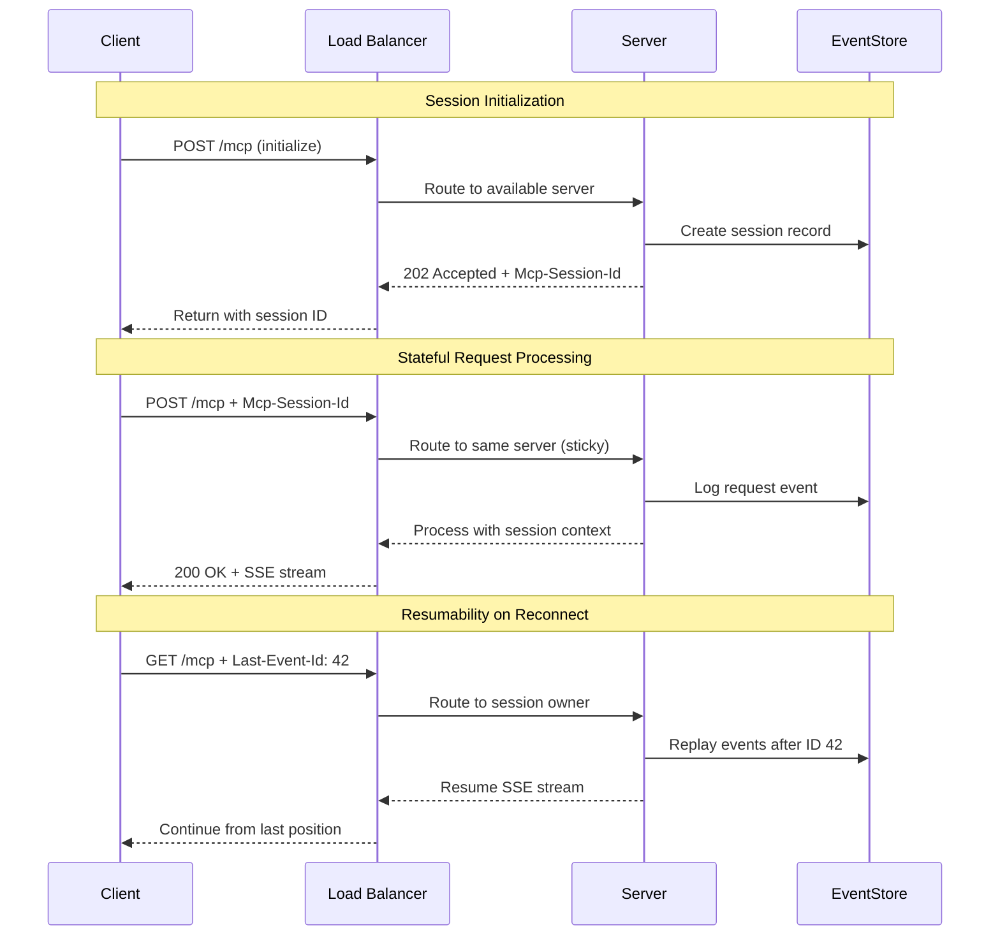

# Calculator Learning Demo - Streamable HTTP (Stateful)

<div align="center">

[](https://modelcontextprotocol.io)
[](https://www.typescriptlang.org/)
[](LICENSE)
[](https://github.com/modelcontextprotocol/streamable-http-reference)

</div>

## 🎯 Overview

This repository demonstrates a **learning-edition MCP calculator server using Streamable HTTP transport in stateful mode**. It showcases true session-based architecture with persistent state, event replay capabilities, and full resumability for enterprise applications.

### Key Characteristics

- **Per-session persistence**: Session-scoped calculation history and state
- **Full resumability**: Event replay via `Last-Event-Id` headers
- **Sticky sessions**: Load balancer compatibility with `Mcp-Session-Id` affinity
- **Event sourcing**: Complete request/response audit trail
- **Perfect for**: Enterprise APIs, complex workflows, multi-step operations

### Stateful Design Philosophy

The **session-based design** maintains server-side state per session, enabling complex workflows, resumable operations, and rich debugging capabilities. Sessions persist for 30 minutes of inactivity.

## 📊 Transport Comparison Table

| Dimension | **STDIO** | **SSE** | **Streamable HTTP** (this) | **Streamable HTTP Stateless** |
|-----------|-----------|---------|----------------------------|-------------------------------|
| **Transport layer** | Local pipes (`stdin`/`stdout`) | 2 × HTTP endpoints (`GET /connect` + `POST /messages`) | **Single HTTP endpoint `/mcp` (JSON or SSE)** | Single HTTP endpoint (per request) |
| **Bidirectional streaming** | ✅ Yes (full duplex) | ⚠️ Server→client only | ✅ **Yes (server push + client stream)** | ✅ Within each request |
| **State management** | Process memory | Server memory (session mapping) | **Session-based (`Mcp-Session-Id`)** | ❌ None (stateless) |
| **Latency** | ⚡ Fastest (microseconds) | 🚀 Good (after connection) | 💫 **Moderate (HTTP overhead)** | 💫 Moderate |
| **Security** | 🔒 Process isolation | 🌐 Network exposed | 🌐 **Network exposed** | 🌐 Network exposed |
| **Scalability** | ⚠️ Single process | ✅ Multi-client | ✅ **Horizontal (with sticky sessions)** | ♾️ Infinite (stateless) |
| **Ideal use case** | Local CLI tools, IDE plugins | Web apps, real-time updates | **Enterprise APIs, complex workflows** | Serverless, edge computing |

## 🔄 Streamable HTTP (Stateful) Transport Flow



Each session maintains state and can be resumed after network interruption using `Last-Event-Id` headers.

## 📊 Golden Standard Feature Matrix

| Name | Status | Implementation |
|------|--------|----------------|
| `calculate` | **Core ✅** | Basic arithmetic with session-scoped streaming progress and history tracking |
| `batch_calculate` | **Extended ✅** | Process multiple calculations, store all results in session history |
| `advanced_calculate` | **Extended ✅** | Factorial, power, sqrt, log, trig functions with session state |
| `demo_progress` | **Extended ✅** | Demonstrates 5 progress notifications with resumable event stream |
| `explain-calculation` | **Core ✅** | Returns Markdown explanation with session context awareness |
| `generate-problems` | **Core ✅** | Returns Markdown practice problems based on session history |
| `calculator-tutor` | **Core ✅** | Returns Markdown tutoring content adapted to user's session progress |
| `solve_math_problem` | **Extended ✅** | Interactive problem solving with session-based follow-up questions |
| `explain_formula` | **Extended ✅** | Formula explanation with examples relevant to session calculations |
| `calculator_assistant` | **Extended ✅** | General calculation assistance with session context |
| `calculator://constants` | **Core ✅** | Mathematical constants (π, e, φ, √2, ln2, ln10) |
| `calculator://history/{id}` | **Extended ✅** | Per-session calculation history (50-item ring buffer) |
| `calculator://stats` | **Extended ✅** | Server uptime, request statistics, and session metrics |
| `session://info/{sessionId}` | **Extended ✅** | Session metadata, creation time, activity statistics |
| `formulas://library` | **Extended ✅** | Collection of mathematical formulas with session usage tracking |

**✅ All 7 tools, 3 prompts, and 5 resources confirmed working with MCP Inspector CLI**

## 🚀 Quick Start

### Prerequisites

- Node.js 18.x or higher
- npm or yarn

### Installation

```bash
# Clone the repository
git clone <repository-url>
cd calculator-learning-demo-streamable-http

# Install dependencies
npm install

# Build the project
npm run build
```

### Running the Server

```bash
# Start the server (port 1453)
npm start

# Development mode with auto-reload
npm run dev

# Test with MCP Inspector CLI
npm run inspector
```

The server will start on `http://localhost:1453`

## 📋 API Examples

### Session Initialization

```bash
curl -X POST http://localhost:1453/mcp \
     -H 'Content-Type: application/json' \
     -d '[{
       "jsonrpc": "2.0",
       "id": 1,
       "method": "initialize",
       "params": {
         "protocolVersion": "1.0.0",
         "capabilities": {},
         "clientInfo": {
           "name": "curl-client",
           "version": "1.0.0"
         }
       }
     }]'

# Response includes session ID in header:
# Mcp-Session-Id: 123e4567-e89b-12d3-a456-426614174000
```

### Basic Calculation with Session

```bash
curl -X POST http://localhost:1453/mcp \
     -H 'Content-Type: application/json' \
     -H 'Mcp-Session-Id: 123e4567-e89b-12d3-a456-426614174000' \
     -d '[{
       "jsonrpc": "2.0",
       "id": 2,
       "method": "tools/call",
       "params": {
         "name": "calculate",
         "arguments": {
           "a": 15,
           "b": 7,
           "op": "multiply"
         }
       }
     }]'

# Response:
{"jsonrpc":"2.0","id":2,"result":{"content":[{"type":"text","text":"Result: 105"}]}}
```

### Streaming Calculation with Progress

```bash
curl -N -X POST http://localhost:1453/mcp \
     -H 'Content-Type: application/json' \
     -H 'Mcp-Session-Id: 123e4567-e89b-12d3-a456-426614174000' \
     -d '[{
       "jsonrpc": "2.0",
       "id": 3,
       "method": "tools/call",
       "params": {
         "name": "calculate",
         "arguments": {
           "a": 100,
           "b": 25,
           "op": "divide",
           "stream": true
         }
       }
     }]'

# Expected SSE output:
event: progress
data: {"progress": 33, "total": 100}

event: progress
data: {"progress": 66, "total": 100}

event: data
data: {"jsonrpc":"2.0","id":3,"result":{"content":[{"type":"text","text":"Result: 4"}]}}
```

### Batch Operations

```bash
curl -X POST http://localhost:1453/mcp \
     -H 'Content-Type: application/json' \
     -H 'Mcp-Session-Id: 123e4567-e89b-12d3-a456-426614174000' \
     -d '[{
       "jsonrpc": "2.0",
       "id": 4,
       "method": "tools/call",
       "params": {
         "name": "batch_calculate",
         "arguments": {
           "calculations": [
             {"a": 10, "b": 5, "op": "add"},
             {"a": 20, "b": 4, "op": "multiply"},
             {"a": 100, "b": 25, "op": "divide"}
           ]
         }
       }
     }]'

# Response:
{"jsonrpc":"2.0","id":4,"result":{"content":[{"type":"text","text":"Results: [15, 80, 4]"}]}}
```

### Access Session Resources

```bash
# Get session calculation history
curl -X POST http://localhost:1453/mcp \
     -H 'Content-Type: application/json' \
     -H 'Mcp-Session-Id: 123e4567-e89b-12d3-a456-426614174000' \
     -d '[{
       "jsonrpc": "2.0",
       "id": 5,
       "method": "resources/read",
       "params": {
         "uri": "calculator://history/latest"
       }
     }]'

# Get session information  
curl -X POST http://localhost:1453/mcp \
     -H 'Content-Type: application/json' \
     -H 'Mcp-Session-Id: 123e4567-e89b-12d3-a456-426614174000' \
     -d '[{
       "jsonrpc": "2.0",
       "id": 6,
       "method": "resources/read",
       "params": {
         "uri": "session://info/123e4567-e89b-12d3-a456-426614174000"
       }
     }]'
```

### Resumability with Last-Event-Id

```bash
# Initial streaming request (save event IDs)
curl -N -X POST http://localhost:1453/mcp \
     -H 'Content-Type: application/json' \
     -H 'Mcp-Session-Id: 123e4567-e89b-12d3-a456-426614174000' \
     -d '[{
       "jsonrpc": "2.0",
       "id": 7,
       "method": "tools/call",
       "params": {
         "name": "demo_progress",
         "arguments": {"steps": 10}
       }
     }]'

# After network interruption, resume from event ID 42:
curl -N -X GET http://localhost:1453/mcp \
     -H 'Accept: text/event-stream' \
     -H 'Mcp-Session-Id: 123e4567-e89b-12d3-a456-426614174000' \
     -H 'Last-Event-Id: 42'
```

The server replays all missed events from ID 42 onwards, then continues with live updates.

### Use Session-Aware Prompts

```bash
curl -X POST http://localhost:1453/mcp \
     -H 'Content-Type: application/json' \
     -H 'Mcp-Session-Id: 123e4567-e89b-12d3-a456-426614174000' \
     -d '[{
       "jsonrpc": "2.0",
       "id": 8,
       "method": "prompts/get",
       "params": {
         "name": "explain-calculation",
         "arguments": {
           "expression": "25 × 4",
           "level": "intermediate"
         }
       }
     }]'
```

## 🔧 Transport Internals

### Session Management

- **Session Creation**: First `initialize` request creates session with UUID
- **Session Headers**: All requests must include `Mcp-Session-Id` header
- **Session Timeout**: 30 minutes of inactivity triggers cleanup
- **Sticky Routing**: Load balancers route by session ID for consistency

### Event Store Integration

- **Event Persistence**: All requests/responses logged with sequential IDs
- **Resumability**: `Last-Event-Id` header enables stream resumption
- **Replay Logic**: Server replays missed events on reconnection
- **History Limits**: Events expire after 24 hours or 10,000 entries per session

### State Architecture

- **Per-Session State**: Calculation history, user preferences, workflow context
- **Global Statistics**: Aggregate metrics across all sessions
- **Memory Management**: Automatic cleanup of expired sessions
- **Persistence Options**: In-memory (default), Redis, or database backends

## 🧪 Testing

```bash
# Run all tests
npm test

# Unit tests - individual components
npm run test:unit

# Integration tests - full request/response cycles
npm run test:integration

# End-to-end tests - real HTTP requests
npm run test:e2e

# Load testing - concurrent sessions
npm run test:load

# Resumability testing - network simulation
npm run test:resume
```

### Key Test Scenarios

1. **Session Lifecycle**: Initialize, use, timeout, cleanup
2. **State Persistence**: Verify calculations stored per session
3. **Resumability**: Network drops and recovery with event replay
4. **Sticky Sessions**: Load balancer routing consistency  
5. **Memory Management**: Session cleanup and resource limits

## 📝 State Management

**Core Design Principle**: Server maintains session-scoped state for rich user experiences.

### What IS Stored Server-Side
- ✅ Per-session calculation history (50-item ring buffer)
- ✅ Session metadata and preferences
- ✅ Event log for resumability (24-hour retention)
- ✅ Global statistics and health metrics
- ✅ Active session registry with timeout management

### Session State Structure
```javascript
{
  sessionId: "123e4567-e89b-12d3-a456-426614174000",
  createdAt: "2024-01-15T10:00:00Z",
  lastActiveAt: "2024-01-15T10:30:00Z", 
  calculationHistory: [...], // Last 50 calculations
  preferences: {...},        // User settings
  eventLog: [...],          // For resumability
  statistics: {...}         // Session-specific metrics
}
```

This stateful design enables complex workflows and provides excellent debugging capabilities.

## 🔒 Security Considerations

- **Session Authentication**: `Mcp-Session-Id` required for all requests
- **Session Isolation**: Complete isolation between different sessions
- **Timeout Protection**: Automatic cleanup prevents session hijacking
- **Input Validation**: Zod schemas validate all parameters per session
- **Rate Limiting**: Per-session request rate limits
- **Event Log Security**: Audit trail of all session activities

## 📊 Production Features

### Health Checks

```bash
curl http://localhost:1453/health

# Response:
{
  "status": "healthy",
  "timestamp": "2024-01-15T10:30:00Z",
  "uptime": 3600,
  "version": "1.0.0",
  "transport": "streamable-http-stateful",
  "sessions": {
    "active": 15,
    "total": 127
  }
}
```

### Session Management Endpoints

```bash
# List active sessions (admin)
curl http://localhost:1453/admin/sessions

# Terminate specific session
curl -X DELETE http://localhost:1453/mcp \
     -H 'Mcp-Session-Id: 123e4567-e89b-12d3-a456-426614174000'

# Export session data
curl http://localhost:1453/admin/sessions/123e4567-e89b-12d3-a456-426614174000/export
```

### Scaling Characteristics

- **Horizontal scaling**: ✅ With sticky session load balancing
- **Session affinity**: Required for state consistency
- **Memory usage**: ~2MB per active session
- **Session limits**: 1000 concurrent sessions per instance
- **Load balancer**: Requires session-aware routing (cookie/header-based)

## 📖 Resources

- [MCP Specification](https://spec.modelcontextprotocol.io)
- [Model Context Protocol Documentation](https://modelcontextprotocol.io)
- [Streamable HTTP Transport](https://spec.modelcontextprotocol.io/specification/basic/transports/#streamable-http)
- [Session Management Best Practices](https://owasp.org/www-community/controls/Session_Management_Cheat_Sheet)

## 📝 License

This project is licensed under the MIT License - see the [LICENSE](LICENSE) file for details.

---

<p align="center">
  ✅ <strong>Stateful Reference Implementation - MCP Learning Edition</strong><br/>
  Full session management with resumability and enterprise-grade state persistence
</p>